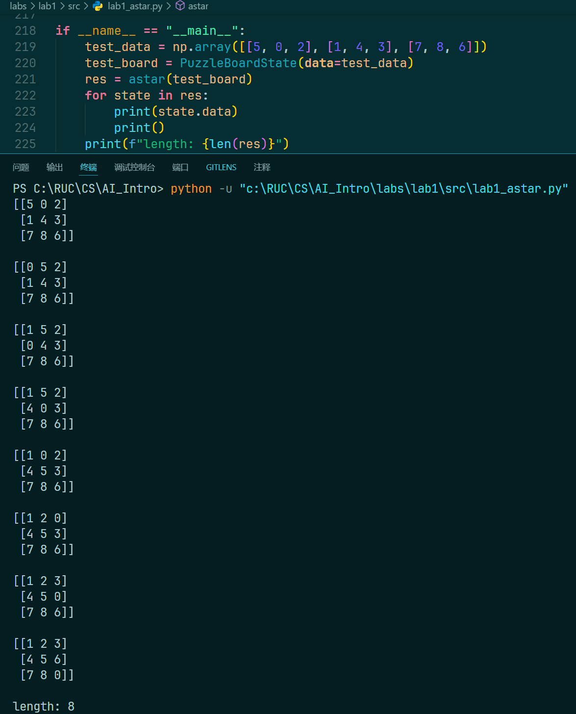

# Lab 1: A* search algorithm for n-puzzle

> :man_student: Charles

## 算法设计

A*算法通过评价函数 $f(n)$ 来计算每个（状态）节点的优先级：

$$
f(n) = g(n) + h(n)
$$

其中， $g(n)$ 为初始状态到当前状态的代价（步数），在遍历过程中逐次累加即可得到。

$h(n)$ 为启发函数，通过计算 **当前状态下，各数字与其正确位置的距离之和** 得到：

```python
def mismatch_dist(state: lab1_astar.PuzzleBoardState):
    """ 求当前棋盘中数字与各自正确位置的距离之和
        相当于A*算法中的启发函数h(n)
    """
    dist = 0
    dst_data = np.array([1, 2, 3, 4, 5, 6, 7, 8, 0]).reshape(3, 3)
    
    for i in range(len(dst_data)):
        for j in range(len(dst_data[0])):
            if state.data[i][j] == dst_data[i][j] or state.data[i][j] == 0:
                continue
            else:
                dst_pos = np.where(dst_data == state.data[i][j])
                dist += (abs(i - dst_pos[0][0]) + abs(j - dst_pos[1][0]))
                
    return dist
```

在A*算法中，维护 `open` 表和 `close` 表来分别存储未访问和已访问的节点。其中，每次要从 `open` 表中取出 $f(n)$ 最小的节点，故采用优先队列实现 `open` ，并自定义其比较方式：

```python
class StateWithF:
    """ 整合state和对应f(n)值的类 
        便于open表的实现
    """
    def __init__(self, g, state) -> None:
        self.state = state
        self.g = g # 起点到当前状态的步数
        self.h = mismatch_dist(state) # 启发函数
        self.f = self.g + self.h # 评价函数

    def __lt__(self, other):
        """ 按f(n)比较大小 """
        return self.f < other.f
    
from queue import PriorityQueue
open = PriorityQueue()
open.put(StateWithF(0, puzzle_board_state))
```

`close` 只用于避免重复探索节点，故直接采用 `set` 实现：

```python
close = set()
close.add(puzzle_board_state.get_data_hash())
```

之后结合 `open` 和 `close` 进行BFS即可：

```python
ans = []
while not open.empty():
    head = open.get()
    cur_state = head.state
    cur_g = head.g

    if cur_state.is_final():
        while cur_state is not None:
            ans.append(cur_state)
            cur_state = cur_state.get_parent()
        break

    next_states = cur_state.next_states()
    for next_state in next_states:
        if next_state.get_data_hash() in close:
            continue
        close.add(next_state.get_data_hash())
        open.put(StateWithF(cur_g + 1, next_state))

ans.reverse()
return ans
```

## 运行结果



