# Lab 2: Alpha-beta Pruning

:man_student: Charles

## 算法设计

本实验需要利用含 $\alpha-\beta$ 剪枝的Minimax算法，在井字棋游戏（Tic-Tac-Toe）中为电脑玩家提供落子决策，即实现决策函数：

```python
def determine_move(board):
    """
        决定电脑(玩家O)的下一步棋(使用Alpha-beta 剪枝优化搜索效率)
        Args:
            board (list):井字棋盘

        Returns:
            next_move(int): 电脑(玩家O) 下一步棋的位置

    """
```

根据Minimax算法原理，将电脑（玩家O）作为max玩家，目标是 **选择最佳落子位置使得棋盘的分数最大化** 。根据已给出代码预定义：

```python
# -1表示X玩家 0表示空位 1表示O玩家.
X_token = -1
Open_token = 0
O_token = 1
```

棋盘分数只有3种可能：

- -1：人类胜
- 1：电脑胜
- 0：平局

因此，可以将 $\alpha$ 和 $\beta$ 分别初始化为极小值和极大值：

```python
alpha = -2
beta = 2
```

同样地，将max玩家（电脑）的max值初始化为极小值：

```python
max_val = -2
```

接下来，对于此时棋盘上每一个空位，尝试落子：

```python
for slot in SLOTS:
    if board[slot] == Open_token:
        board[slot] = O_token
```

利用Minimax算法（具体实现方法稍后讨论），计算落子后，棋盘的分数 `new_val` ：

```python
new_val = minimax(board, X_token, alpha, beta)
```

如果这个新的分数比原来的最大分数更大，则更新最大分数 `max_val` 和最佳落子位置 `next_move` ：

```python
if (new_val > max_val):
    max_val = new_val
    next_move = slot
```

最后需要还原棋盘，以便继续探索其他可落子位置：

```python
board[slot] = Open_token
```

如此检查完所有可落子位置之后，便得到了下一步的最佳落子位置：

```python
return next_move
```

**下面实现Minimax算法。**

相应函数声明为：

```python
def minimax(board, player, alpha, beta):
    """ 采用alpha-beta剪枝的minimax算法，返回当前棋盘的分数 """
```

首先，根据当前期盼状态 `board` 判断棋局是否已经结束，若结束则直接返回相应分数：

```python
win = winner(board)
if win != 0:
    return win  # 胜负已分
if legal_move_left(board) == False:
    return 0  # 平局
```

接下来，根据当前执棋方，遍历各可落子位置，递归更新 `alpha` 和 `beta` 并在需要时（ `alpha >= beta` 时）剪枝，最后得出当前棋盘的分数。

例如，如果当前玩家为电脑（玩家O，max玩家）：

```python
if player == O_token:
    max_val = -2  # 初始max值
    for slot in SLOTS:
        # 遍历所有可落子的位置
        if board[slot] == Open_token:
            board[slot] = O_token  # 尝试落子
            cur_val = minimax(board, X_token, alpha, beta)  # 计算之后的分数
            board[slot] = Open_token  # 还原棋盘
            max_val = max(cur_val, max_val)  # 更新max值
            alpha = max(alpha, max_val)
            if beta <= alpha:
                break  # 剪枝
    return max_val
```

当前玩家为人类时，同理求 `min_val` 即可。

综上，决策函数 `determine_move()` 整体为：

```python
def determine_move(board):
    """
        决定电脑(玩家O)的下一步棋(使用Alpha-beta 剪枝优化搜索效率)
        Args:
            board (list):井字棋盘

        Returns:
            next_move(int): 电脑(玩家O) 下一步棋的位置

    """
    def minimax(board, player, alpha, beta):
        """ 采用alpha-beta剪枝的minimax算法，返回当前棋盘的分数 """
        win = winner(board)
        if win != 0:
            return win  # 胜负已分
        if legal_move_left(board) == False:
            return 0  # 平局

        # 当前玩家为电脑（玩家O，max玩家）
        if player == O_token:
            max_val = -2  # 初始max值
            for slot in SLOTS:
                # 遍历所有可落子的位置
                if board[slot] == Open_token:
                    board[slot] = O_token  # 尝试落子
                    cur_val = minimax(board, X_token, alpha, beta)  # 计算之后的分数
                    board[slot] = Open_token  # 还原棋盘
                    max_val = max(cur_val, max_val)  # 更新max值
                    alpha = max(alpha, max_val)
                    if beta <= alpha:
                        break  # 剪枝
            return max_val
        
        # 当前玩家为人类（玩家X，min玩家）
        else:
            min_val = 2  
            for slot in SLOTS:
                if board[slot] == Open_token:
                    board[slot] = X_token
                    cur_val = minimax(board, O_token, alpha, beta)
                    board[slot] = Open_token
                    min_val = min(cur_val, min_val)
                    beta = min(beta, min_val)
                    if alpha >= beta:
                        break
            return min_val
     
    # 初始化alpha和beta
    alpha = -2
    beta = 2
    max_val = -2

    # 计算不同落子位置对应的分数，取分数最大处落子
    for slot in SLOTS:  
        if board[slot] == Open_token:
            board[slot] = O_token
            cur_val = minimax(board, X_token, alpha, beta)
            if (cur_val > max_val):
                max_val = cur_val
                next_move = slot
            board[slot] = Open_token
    return next_move
```

## 运行结果

若人类先手，

电脑胜利：

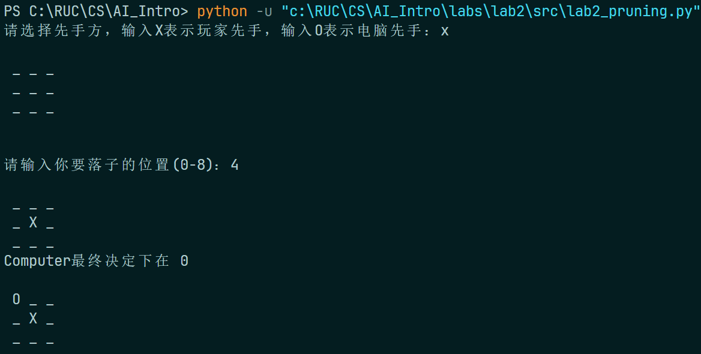 

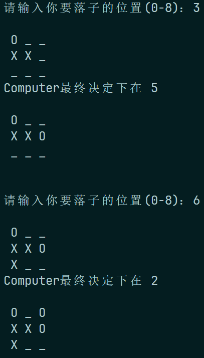 

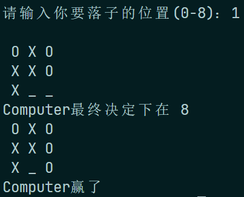 

打成平局：

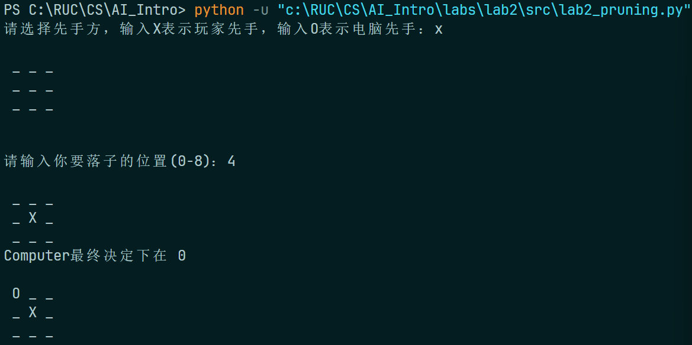 

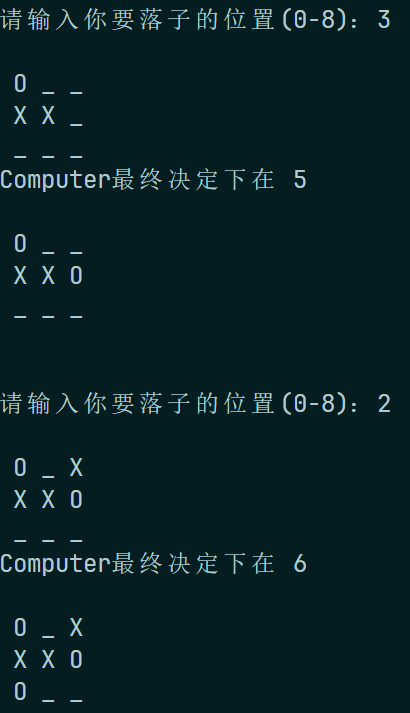 

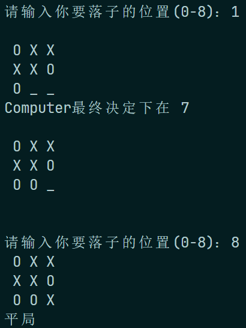 

若电脑先手，

电脑胜利：

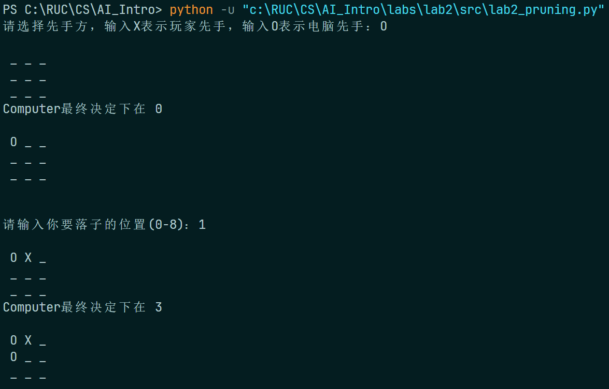 

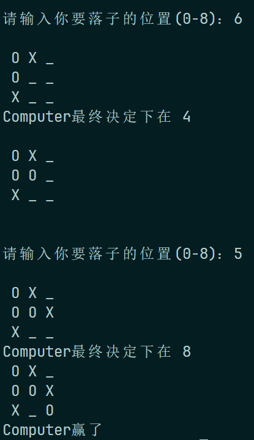 

打成平局：

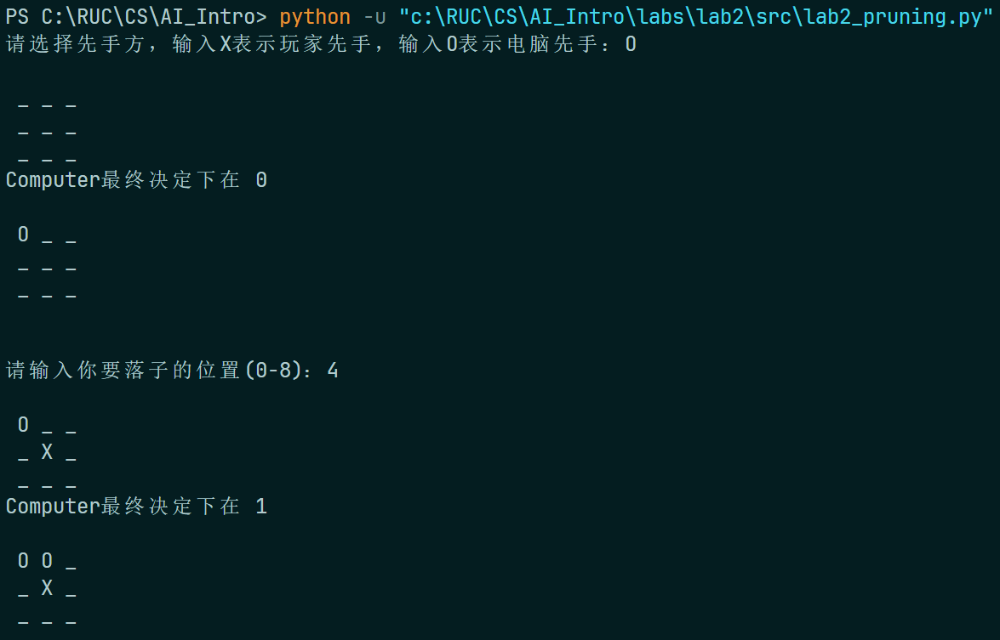 

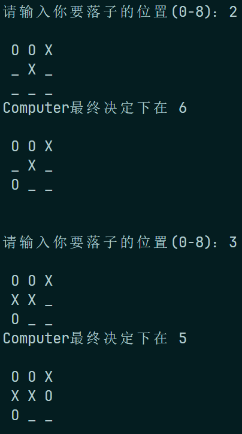 

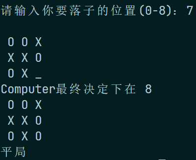 

经过多次检验：在人类不失误的情况下，电脑总能打成平局；否则，电脑会胜利；可以认为实验结果良好。