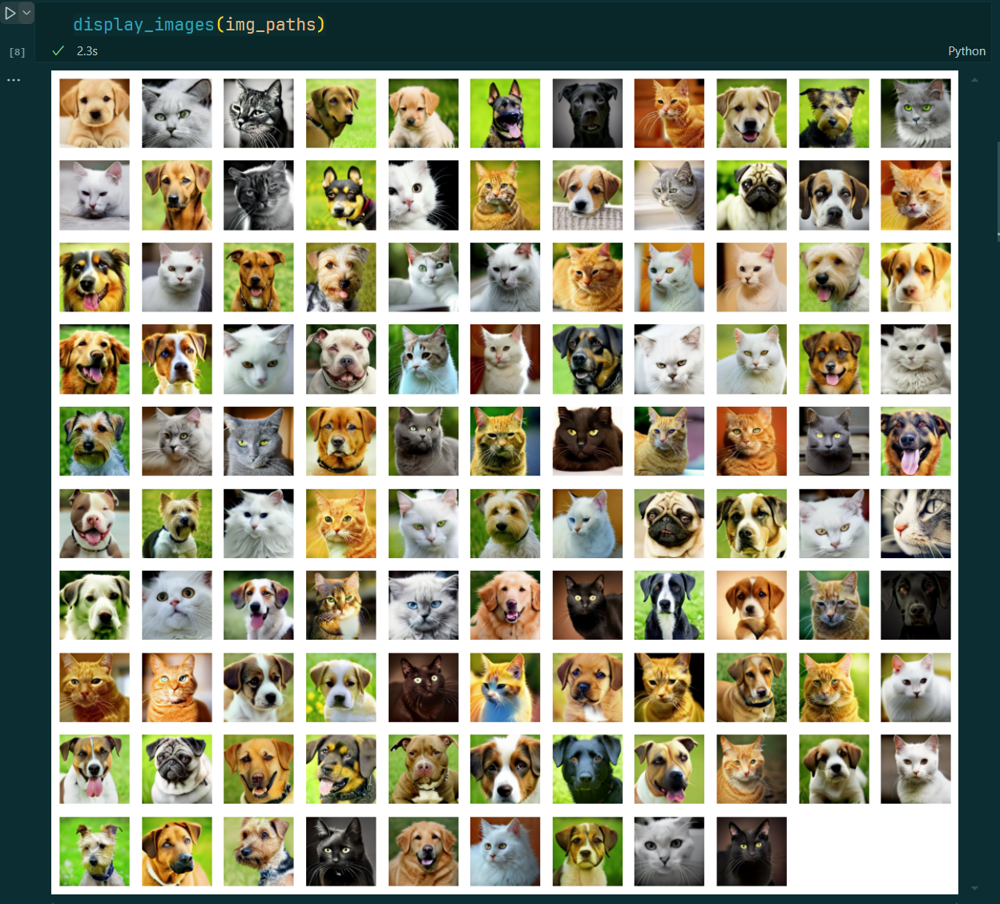
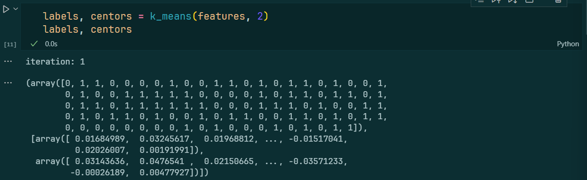
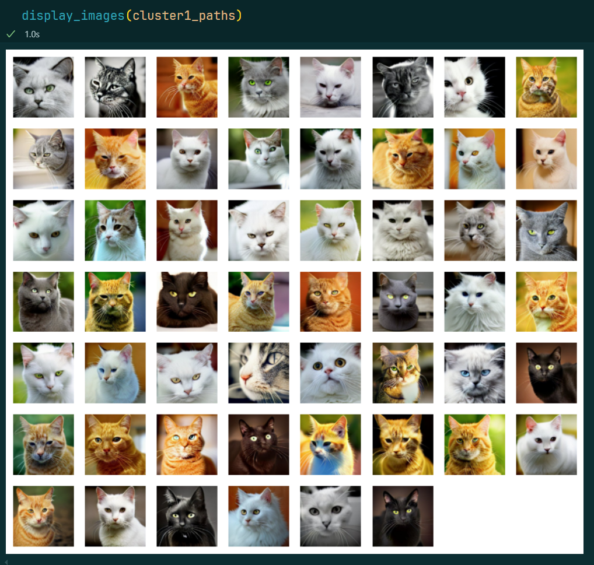
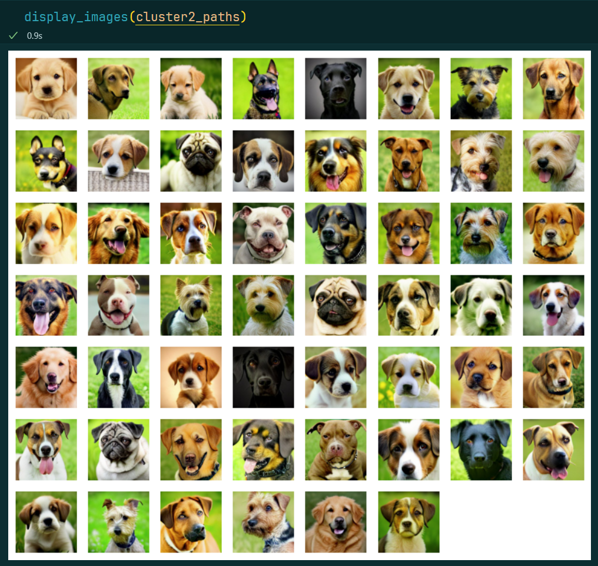
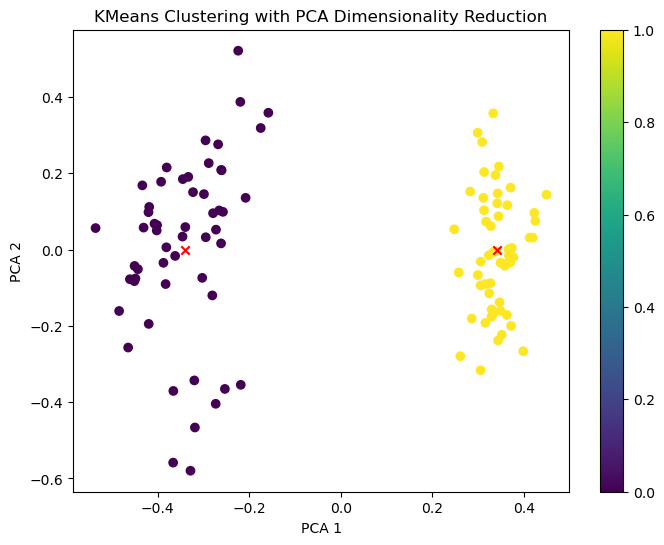

# Lab 3: K-means

:man_student: Charles

## 实验概述

用python实现 **K-means** 聚类算法，算法输入 `n` 个数据、分类数 `k` ，输出 `n` 个数据的聚类类别、 `k` 个类别中心。

## 实验过程

### 数据准备

本次实验采用的数据集为Kaggle上的一组由AI生成的猫狗图像 [AI Cat and Dog Images DALL·E Mini](https://www.kaggle.com/datasets/mattop/ai-cat-and-dog-images-dalle-mini) ，可通过API下载：
```python
import kagglehub
# 从kaggle上下载数据集（猫狗图片）
download_path = kagglehub.dataset_download("mattop/ai-cat-and-dog-images-dalle-mini", force_download=True)
```

为了后续聚类，首先将原数据集中已分类的图片打乱。打乱后的图片数据集如下：



### 特征提取

接下来，利用 [文澜提供的API](https://github.com/chuhaojin/WenLan-api-document) 对这些图片进行特征提取：

```python
import numpy as np
import requests

def get_image_feature(img_path, api_url):
    """ 抽取图片的特征向量 """
    files = {"image": open(img_path, "rb")}
    r = requests.post(api_url, files=files)
    r_dict = r.json()
    return np.array(r_dict['embedding'])

url = "http://bl.mmd.ac.cn:8889/image_query"
features = []
for i, img_path in enumerate(img_paths):
    feature = get_image_feature(img_path, url)
    features.append(feature)
    print(f"Get feature of image[{i + 1}/{len(img_paths)}]")
```

每张图片提取2048维特征，存在 `features` 列表中。

### 算法设计

手动实现一个K-means聚类函数，思路见注释：

```python
def k_means(points, k, epsilon=1e-4, max_iteration=100):
    """ k-means聚类 
    Args:
        points (any): 待聚类的点
        k (int): 分类数目
        epsilon (float): 质心收敛的阈值
        max_iteration (int): 最大迭代次数
    Returns:
        labels (np.ndarray): 聚类得出的points的标签
        centors (list): 各聚类的中心
    """
    n = len(points)
    labels = np.zeros(n, dtype=int)  # 各点的标签
    centors = []  # 质心

    # 随机初始化质心
    centor_ids = [random.randint(0, n) for _ in range(k)]
    for i in range(k):
        centor_id = centor_ids[i]
        centors.append(points[centor_id])
        labels[centor_id] = i
    
    for it in range(max_iteration):
        # 计算其他各点到质心的距离
        for i, point in enumerate(points):
            min_dist = float('inf')
            for j, centor in enumerate(centors):
                dist = np.linalg.norm(point - centor)
                # 某点到新质心的距离更近，则更新其标签
                if dist < min_dist:
                    min_dist = dist
                    labels[i] = j

        # 更新质心
        point_counts = np.zeros(k)  # 每个聚类里面点的个数
        cluster_sum = np.zeros((k, len(points[0])))  # 每个聚类中的点求和
        for i, point in enumerate(points):
            label = labels[i]
            point_counts[label] += 1
            cluster_sum[label] += point
        
        converged = True  # 质心是否收敛
        for i in range(k):
            new_centor = cluster_sum[i] / point_counts[i]  # 计算新质心
            if np.linalg.norm(new_centor - centors[i]) >= epsilon:
                # 质心未收敛，继续更新
                converged = False
                centors[i] = new_centor 
        
        if converged:
            print(f"iteration: {it}")
            break
    
    return labels, centors
```

## 实验结果

用K-means聚类得到数据类别标签和质心：



> 由于数据集很简单，一般只需要一两轮K-means聚类就会返回结果。

按照标签，将打乱的图片集重新分类：

```python
cluster1_paths = []
cluster2_paths = []
for i, label in enumerate(labels):
    if label == 1:
        cluster1_paths.append(img_paths[i])
    else:
        cluster2_paths.append(img_paths[i])
```

可以看到，算法将图片成功分类：

|  |  |
| ---------------------- | ---------------------- |

用 `PCA` 将特征向量降为2维后，也可以在散点图上将聚类结果可视化：



> :x: 表示质心。
