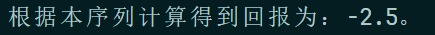
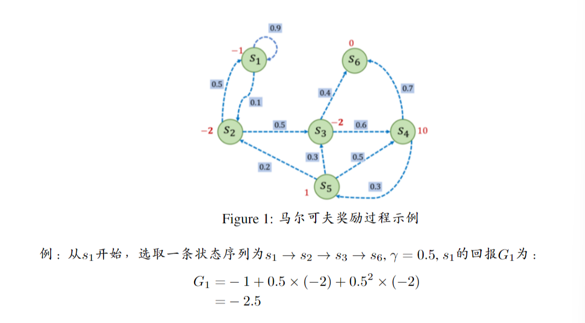
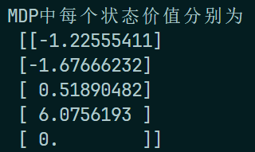
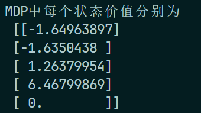
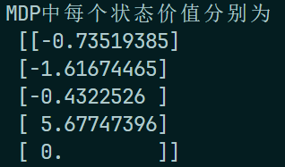
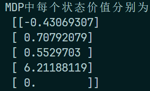
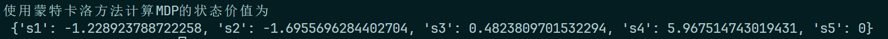
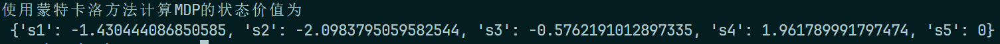

# Lab 5: Reinforcement Learning

:man_student: Charles

## 实验概述

- 完成马尔可夫奖励过程（MRP）和马尔可夫决策过程（MDP）的相关代码补全
- 调整折扣因子 $\gamma$ 、状态转移函数 $P(s', a)$ 等参数，观察分析决策过程的变化

## 实验过程

:one: **在MRP中，给定一条序列,计算从某个索引（起始状态）开始到序列最后（终止状态）得到的回报。**

根据实验文档中MRP中的回报计算公式：

$$
\begin{align}
G_t &= R_t + \gamma{R_{t+1}} + \gamma{R_{t+2}} + ... \\
&= \sum^\infty_{k=0} {\gamma^{k}{R_{t+k}}}
\end{align}
$$

可补全对应代码如下：

```python
def compute_return(start_index, chain, gamma):
    G = 0
    for i in reversed(range(start_index, len(chain))):
        # TODO ~1: 实现回报函数
        k = i - start_index  # gamma的指数
        s = chain[i] - 1  # 状态序号
        G += gamma ** k * rewards[s]
    return G
```

运行代码：

```python
# 一个状态序列,s1-s2-s3-s6
chain = [1, 2, 3, 6]
start_index = 0
G = compute_return(start_index, chain, gamma)
print("根据本序列计算得到回报为：%s。" % G)
```

输出：

 

该结果与实验文档中手动计算的结果相同：

 

---

:two: **动手修改状态转移函数等参数，体会决策过程变化**

```python
gamma = 0.5
# 转化后的MRP的状态转移矩阵
# TODO ~2: 动手修改状态转移函数等参数，体会决策过程变化
P_from_mdp_to_mrp = [
    [0.5, 0.5, 0.0, 0.0, 0.0],
    [0.5, 0.0, 0.5, 0.0, 0.0],
    [0.0, 0.0, 0.0, 0.5, 0.5],
    [0.0, 0.1, 0.2, 0.2, 0.5],
    [0.0, 0.0, 0.0, 0.0, 1.0],
]

P_from_mdp_to_mrp = np.array(P_from_mdp_to_mrp)
R_from_mdp_to_mrp = [-0.5, -1.5, -1.0, 5.5, 0]

V = compute(P_from_mdp_to_mrp, R_from_mdp_to_mrp, gamma, 5)
print("MDP中每个状态价值分别为\n", V)
```

上述原始数据下，MDP中的各状态价值为：

 

增大 $\gamma = 0.8$ ：

 

> 可以看到，由于折扣因子变大，MDP对未来奖励的重视提高， `s3` 和 `s4` 这样通往高奖励的状态的价值有较显著提升。

减小 $\gamma = 0.2$ ：

 

> 可以看到，由于折扣因子变小，MDP更注重当下的奖励，例如 `s3` 直接从正数变成了负数（其对应 `r3` 本身也是负数 -1.0）

将 $\gamma$ 调回0.5，修改状态转移概率矩阵为：
```python
P_from_mdp_to_mrp = [
    [0.5, 0.5, 0.0, 0.0, 0.0],
    [0.1, 0.0, 0.2, 0.7, 0.0],
    [0.0, 0.0, 0.0, 0.5, 0.5],
    [0.0, 0.1, 0.2, 0.2, 0.5],
    [0.0, 0.0, 0.0, 0.0, 1.0],
]
```

> 此处将 `s2` 的转移概率从 `[0.5, 0.0, 0.5, 0.0, 0.0]` 调整为 `[0.1, 0.0, 0.2, 0.7, 0.0]` 

得到：

 

> 可以看到，由于 `s2` 转移到 `s4` （高奖励状态）的概率提升了（0到0.7），MDP下 `s2` 的状态价值也相应得到提升（-1.68到0.71）

---

:three: **对所有采样序列计算所有状态的价值**

根据实验文档，采用蒙特卡罗方法（MC）进行每一个价值的价值计算。根据公式：

$$
\begin{align}
& N(s) \leftarrow N(s) + 1 \\
& V(s) \leftarrow V(s) + \frac{G-V(s)}{N(s)}
\end{align}
$$

可补全代码如下：

```python
def MC(episodes, V, N, gamma):
    for episode in episodes:
        G = 0
        for i in range(len(episode) - 1, -1, -1):  # 一个序列从后往前计算
            (s, a, r, s_next) = episode[i]
            # TODO ~3: 代码填空
            G = r + gamma * G
            N[s] = N[s] + 1
            V[s] = V[s] + (G - V[s]) / N[s]
```

运行：

```python
timestep_max = 20
# 采样1000次,可以自行修改
episodes = sample(MDP, Pi_1, timestep_max, 1000)
gamma = 0.5
V = {"s1": 0, "s2": 0, "s3": 0, "s4": 0, "s5": 0}
N = {"s1": 0, "s2": 0, "s3": 0, "s4": 0, "s5": 0}
MC(episodes, V, N, gamma)
print("使用蒙特卡洛方法计算MDP的状态价值为\n", V)
```

输出：



上述采样的策略是 `Pi_1` ，即随机策略：

```python
# 策略1,随机策略
Pi_1 = {
    "s1-保持s1": 0.5,
    "s1-前往s2": 0.5,
    "s2-前往s1": 0.5,
    "s2-前往s3": 0.5,
    "s3-前往s4": 0.5,
    "s3-前往s5": 0.5,
    "s4-前往s5": 0.5,
    "s4-概率前往": 0.5,
}
```

接下来尝试换个策略 `Pi_2`：

```python
# 策略2
Pi_2 = {
    "s1-保持s1": 0.6,
    "s1-前往s2": 0.4,
    "s2-前往s1": 0.3,
    "s2-前往s3": 0.7,
    "s3-前往s4": 0.5,
    "s3-前往s5": 0.5,
    "s4-前往s5": 0.1,
    "s4-概率前往": 0.9,
}
```

运行后，得到：



> 对比上一次，可以看到，由于策略 `Pi_2` 中 `"s4-前往s5"` 的概率从0.5调低至0.1，而奖励函数中该动作的奖励很高：
>
> ```python
> # 奖励函数
> R = {
>     "s1-保持s1": -1,
>     "s1-前往s2": 0,
>     "s2-前往s1": -1,
>     "s2-前往s3": -2,
>     "s3-前往s4": -2,
>     "s3-前往s5": 0,
>     "s4-前往s5": 10,
>     "s4-概率前往": 1,
> }
> ```
>
> 所以， `Pi_2` 下 `s4` 的状态价值比 `Pi_1` 下低了不少（5.97到1.96）。
