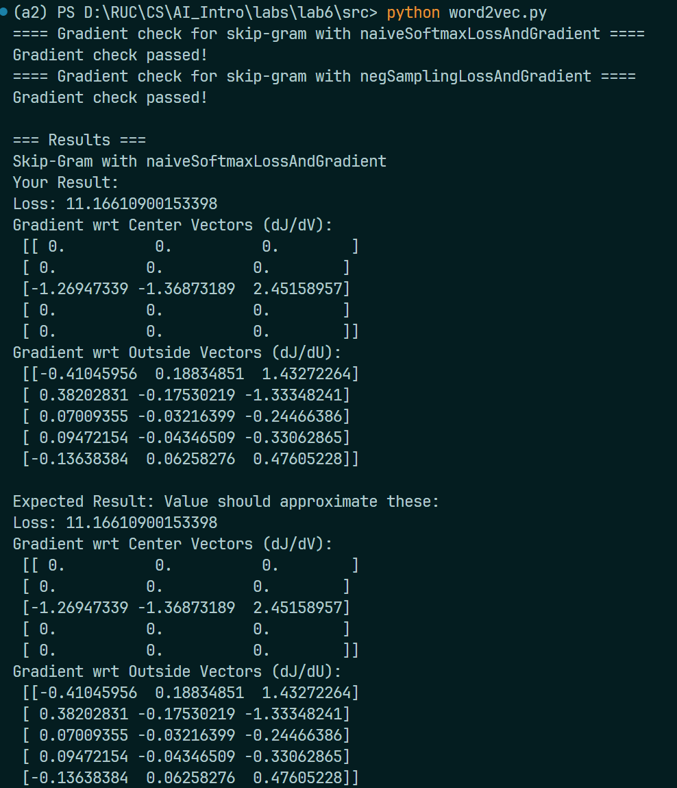
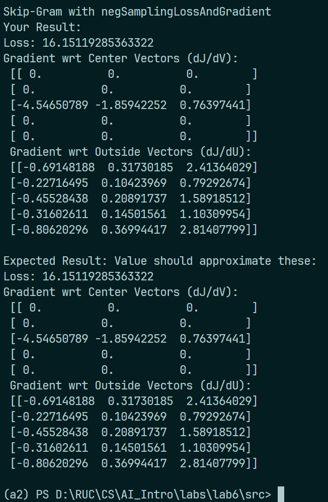
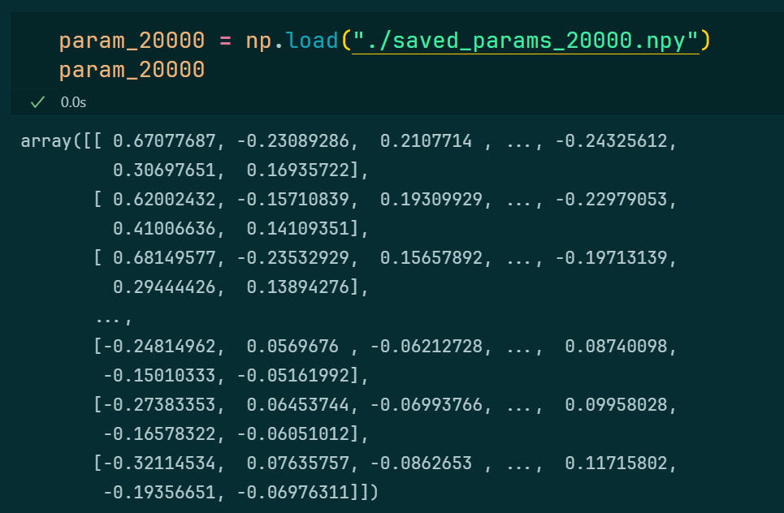
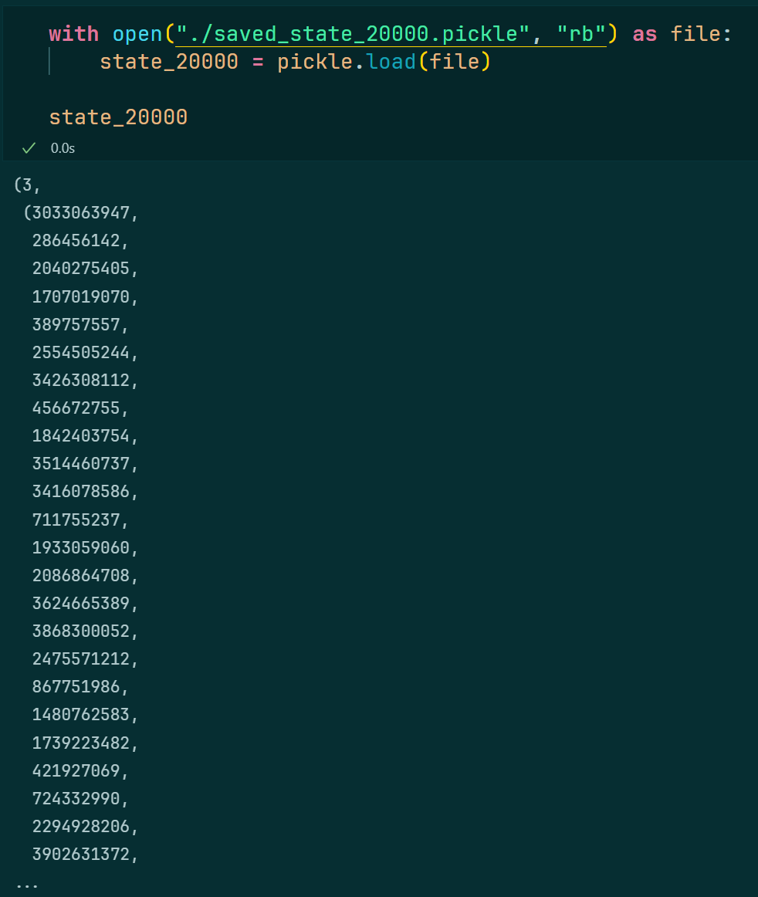
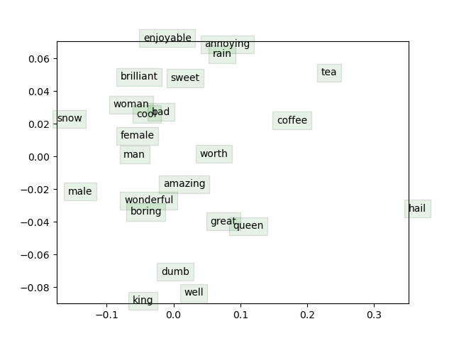

# Lab 6: Word2Vec

:man_student: Charles

## 实验概述

补全 `word2vec.py` 中的代码，实现skip-gram算法来生成词嵌入向量（word to vector）。

## 实验过程

### 实现 $sigmoid$ 函数

根据 $sigmoid$ 函数的公式：

$$
sigmoid(x) = \frac{1}{1 + e^{-x}}
$$

易完成代码如下：

```python
def sigmoid(x):
    """
    Compute the sigmoid function for the input here.
    Arguments:
    x -- A scalar or numpy array.
    Return:
    s -- sigmoid(x)
    """

    # TODO YOUR CODE HERE
    s = 1 / (1 + np.exp(-x))
    # TODO END YOUR CODE

    return s
```

### 实现损失函数

skip-gram中，计算中心单词向量和外部词向量的损失函数为：

$$
J(v_c, o, U) = - \log{P(O=o|C=c)}
$$

其中， $P(O=o|C=c)$ 通过 $softmax$ 函数计算：

$$
P(O=o|C=c) = \frac{\exp(u_o^\top v_c)}{\sum_{w \in Vocab}\exp(u_w^\top v_c)}
$$

代码注释中说明了 `outsideVectors` 对应 $U$ ，其中每个行向量即为 $u_o^\top$ ； `centerWordVec` 对应 $v_c$ ，故将二者进行矩阵乘法后再 `softmax` 即可得到 $\hat{y}$ ，也就是 $P(O=o|C=c)$ ：

```python 
score = np.dot(outsideVectors, centerWordVec)
y_hat = softmax(score)
```

又 `outsideWordIdx` 对应 $u_o$ 的下标 $o$ ，可计算损失 `loss` 为：

```python
loss = -np.log(y_hat[outsideWordIdx])
```

### 实现损失函数求导

对上述损失函数求导，用 `gradCenterVec` 表示 $\frac{\partial{J}}{\partial{v_c}} = U^\top(\hat{y}_c - y_c)$ ，根据公式易写出代码：

```python
gradCenterVec = np.dot(outsideVectors.T, (y_hat - y))
```

用 `gradOutsideVecs` 表示 $\frac{\partial{J}}{\partial{U}} = (\hat{y}_c - y_c)v_c^\top$ ，根据公式写出代码：

```python
gradOutsideVecs = np.outer((y_hat - y), centerWordVec)
```

> 用 `outer` ：采用外积以便生成梯度矩阵

综上，求损失函数及其梯度的方法实现为：

```python
def naiveSoftmaxLossAndGradient(
        centerWordVec,
        outsideWordIdx,
        outsideVectors,
        dataset
):
    """ Naive Softmax loss & gradient function for word2vec models

    Implement the naive softmax loss and gradients between a center word's 
    embedding and an outside word's embedding. This will be the building block
    for our word2vec models.

    Arguments:
    centerWordVec -- numpy ndarray, center word's embedding
                    (v_c in the pdf handout)
    outsideWordIdx -- integer, the index of the outside word
                    (o of u_o in the pdf handout)
    outsideVectors -- outside vectors (rows of matrix) for all words in vocab
                      (U in the pdf handout)
    dataset -- needed for negative sampling, unused here.

    Return:
    loss -- naive softmax loss
    gradCenterVec -- the gradient with respect to the center word vector
                     (dJ / dv_c in the pdf handout)
    gradOutsideVecs -- the gradient with respect to all the outside word vectors
                    (dJ / dU)
    """

    # TODO 计算loss
    score = np.dot(outsideVectors, centerWordVec)
    y_hat = softmax(score)
    loss = -np.log(y_hat[outsideWordIdx])
    #

    N = outsideVectors.shape[0]
    y = np.zeros(N)
    y[outsideWordIdx] = 1
    # TODO 计算梯度
    gradCenterVec = np.dot(outsideVectors.T, (y_hat - y))
    gradOutsideVecs = np.outer((y_hat - y), centerWordVec)
    #

    return loss, gradCenterVec, gradOutsideVecs
```

## 实验结果

### 代码正确性检查

运行 `word2vec.py` ：

|  |  |
| --------------------------------- | --------------------------------- |

从输出情况可见，代码补全正确。

### 训练 `word2vec` 

训练20000轮，读取保存的参数和状态：

 

 

生成的word2vec可视化图片如下：

 

通过word2vec，这些词向量的几何分布可以反应它们在语义空间中的特征。以上图为例，我们可以发现：`queen` 到 `king` 的 **方向** 和 **距离** 都与 `female` 到 `male` 的很接近，说明这两组词在语义上有着相似的关系。
