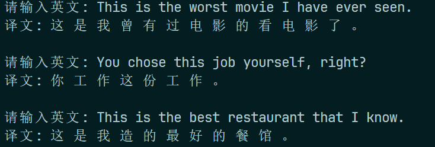

# Lab 7: Transformer in Machine Translation

:man_student: Charles

## 实验概述

补全代码，实现自然语言处理中的机器翻译（Neural Machine Translation, NMT）。

## 实验过程

### 基础部分

**Task 1: 实现 Self-Attention 的计算**

采用Scaled Dot-Product Attention计算注意力分布，相关公式为：
$$
\begin{align}
& \text{score}(Q, K) = \frac{Q K^\top}{\sqrt{d_k}} \\
& \text{Attention}(Q, K, V) = \text{softmax}(\text{score}(Q, K))V
\end{align}
$$
其中 $\sqrt{d_k}$ 是查询和键的维度。据此实现代码如下：

```python
def attention(query, key, value, mask=None, dropout=None):
    """
    Scaled Dot-Product Attention（方程（4））
    """
    ### TODO 基础 task 1：实现 Self-Attention 的计算
    # query和key的维度
    d_k = query.size(-1)
    d_k = torch.tensor(d_k, dtype=torch.float32)  
    # 打分函数
    score = torch.matmul(query, key.transpose(-2, -1)) / torch.sqrt(d_k)
    # mask（如果有）
    if mask is not None:
        score = score.masked_fill(mask == 0, float('-inf'))
    # softmax后得到注意力权重
    p_attn = F.softmax(score, dim=-1)
    # dropout
    if dropout is not None:
        p_attn = dropout(p_attn)
    # 注意力对v加权
    return torch.matmul(p_attn, value), p_attn
```

---

**Task 2: 调用 encode/decode 实现 Transformer 的 forward** 

由于 `Transformer` 类中， `encode` 和 `decode` 方法都已定义好，因此代码补全部分直接进行编码、解码即可：

```python
def forward(self, src, tgt, src_mask, tgt_mask):
    # encoder的结果作为decoder的memory参数传入，进行decode
    # TODO 基础 - task 2: 调用 encode/decode 实现 Transformer 的 forward
    # encode得到memory
    memory = self.encode(src, src_mask)
    # 对memory进行decode
    output = self.decode(memory, src_mask, tgt, tgt_mask)
    return output
```

---

**Task 3: 将输入的英文语句分词并转为单词 id 表示**

这部分利用准备好的 `en_word_dict` （word2id的字典）实现：

```python
# TODO 基础 - task 3: 将输入的英文语句分词并转为单词 id 表示
sentence_en = sentence_en.split()  # 分词
sentence_en_ids = [
    data.en_word_dict.get(word, data.en_word_dict["UNK"])
    for word in sentence_en
]
```

### 附加内容

**Question 1: 为什么trg舍弃最后一个字符，trg_y舍弃第一个字符？**

```python
# TODO 拓展 question 1 : 为什么trg舍弃最后一个字符，trg_y舍弃第一个字符？
# 解码器使用的目标输入部分
self.trg = trg[:, : -1] # 去除最后一列
# 解码器训练时应预测输出的目标结果
self.trg_y = trg[:, 1:] #去除第一列的SOS
# 将目标输入部分进行注意力掩码
self.trg_mask = self.make_std_mask(self.trg, pad)
# 将应输出的目标结果中实际的词数进行统计
self.ntokens = (self.trg_y != pad).data.sum()
```

`trg` 是**输入**序列， `trg_y` 是**输出**序列，其中 `trg_y` 的每个字符都是根据 `trg` 相同位置的字符预测得出的。例如，不舍弃字符的初始状态下：

```sh
trg = "<SOS> This is an example <EOS>"
trg_y = "<SOS> This is an example <EOS>"
```

我们希望的预测应当是 `This -> is -> an -> example` 这样，由前一个字符预测出下一个字符，因此如果要让输入输出“对齐”，则应该舍弃 `trg` 的最后一个字符 `<EOS>` 和 `trg_y` 的第一个字符 `<SOS>` ：

```sh
trg = "<SOS> This is an example"
trg_y = "This is an example <EOS>"
```

这样才能保证 `trg_y[i]` 可以由 `trg[i]` 预测出来。 

---

**Question 2: 训练过程和测试过程decoder的输入有何不同？**

训练过程中，decoder输入的是已知的目标序列，每一步根据目标序列的当前单词预测下一个单词；测试过程中，decoder每一步的输入则是模型自己上一步预测生成的单词。

## 实验结果

根据多次实验，本地环境在下面超参数下训练效率和效果较好：

```python
PAD = 0  # padding占位符的索引
UNK = 1  # 未登录词标识符的索引
BATCH_SIZE = 256  # 批次大小
EPOCHS = 60  # 训练轮数
LAYERS = 4  # transformer中encoder、decoder层数
H_NUM = 4  # 多头注意力个数
D_MODEL = 256  # 输入、输出词向量维数
D_FF = 512  # feed forward全连接层维数
DROPOUT = 0.1  # dropout比例
MAX_LENGTH = 60  # 语句最大长度
```

> - 增加训练轮数直到损失收敛（经测试，60轮左右开始收敛， `loss < 0.1` ）
> - 根据本地显存大小，将 `BATCH_SIZE` 增大为256
> - 尝试增加输入、输出词向量维数和多头注意力个数等，但是对降低损失效果不明显、且较大程度降低训练和收敛速度，可能是因为数据集比较简单（基本都是单个句子，无长文本），复杂模型的效果不佳；因此，降低 `D_FF` 和 `H_NUM` 以简化模型。

将训练过程损失可视化：

 

调用 `translate()` 实测翻译（输入来源非训练集）：

 
