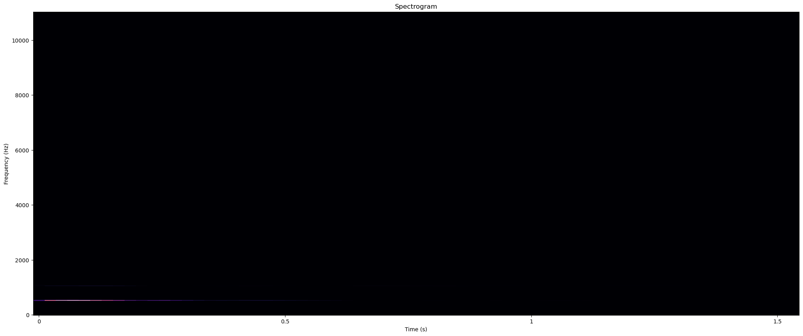

# Lab 9: Speech Feature Extraction

:man_student: Charles

## 实验概述

补全代码，完成四个声学特征提取任务，学习 `librosa` 库的基本使用。

## 实验过程及结果

### Task 1

从输入信号中获取amplitude_envelope：

```python
# Task 1
def amplitude_envelope(signal, frame_size, hop_length) -> np.ndarray:
    """Calculate the amplitude envelope of a signal with a given frame size and hpp_length."""
    # Hint: recall the definition of amplitude_envelope
    n_frames = 1 + (len(signal) - frame_size) // hop_length  # 总帧数
    amp_envelope = np.zeros(n_frames)  # 初始化 amplitude envelope

    # 遍历每个 frame ，计算对应的 amplitude envelope
    for i in range(n_frames):
        start = i * hop_length
        end = start + frame_size
        amp_envelope[i] = np.max(np.abs(signal[start:end]))
    return amp_envelope
```

### Task 2

音频信号可视化：

```python
# Task 2
# Visualising audio signal in the frequency domain
def plot_magnitude_spectrum(signal, sr, title, f_ratio=1):
    """Time domain -> Frequency domain"""
    # Hint: calculate the FT of signal, then calculate the absolute value to get magnitude
    X_ft = np.fft.fft(signal)  # 傅里叶变换
    # X_mag = np.zeros_like(signal) # need to be modified
    X_mag = np.abs(X_ft)

    # make a plot
    plt.figure(figsize=(18, 5))

    f = np.linspace(0, sr, len(X_mag))
    f_bins = int(len(X_mag)*f_ratio)

    plt.plot(f[:f_bins], X_mag[:f_bins])
    plt.xlabel('Frequency (Hz)')
    plt.title(title)

plot_magnitude_spectrum(sound, sr, "Sound", 0.1)
```

输出图像：


### Task 3

频谱图可视化：

```python
# Task 3
def plot_spectrogram(Y, sr, hop_length, y_axis="linear"):
    """Visualizing the spectrogram"""
    plt.figure(figsize=(25, 10))
    # Hint: y_axis choice: "linear", "log"
    # Hint: use librosa.display.specshow()
    librosa.display.specshow(Y, x_axis='time', y_axis=y_axis, sr=sr, hop_length=hop_length)

    # 展示图像
    plt.title("Spectrogram")
    plt.xlabel("Time (s)")
    plt.ylabel("Frequency (Hz)")
    plt.show()


FRAME_SIZE = 2048
HOP_SIZE = 512
S_scale = librosa.stft(sound, n_fft=FRAME_SIZE, hop_length=HOP_SIZE) # Extracting Short-Time Fourier Transform
Y_scale = np.abs(S_scale) ** 2  # Calculating the spectrogram
plot_spectrogram(Y_scale, sr, HOP_SIZE) # Visualizing the spectrogram
Y_log_scale = librosa.power_to_db(Y_scale)
plot_spectrogram(Y_log_scale, sr, HOP_SIZE,y_axis='log') # Log-Frequency Spectrogram
```

输出图像：




### Task 4

MFCC特征可视化：

```python
# Task 4
# Visualising MFCCs
def plot_mfccs(Y, sr, n_mfcc=13):
    # Hint: extract mfccs, use librosa.feature.mfcc()
    # mfccs = None        # need to be modified
    mfccs = librosa.feature.mfcc(y=Y, sr=sr, n_mfcc=n_mfcc)

    
    plt.figure(figsize=(25, 10))
    librosa.display.specshow(mfccs,
                             x_axis="time",
                             sr=sr)
    plt.colorbar(format="%+2.f")
    plt.title("MFCCs")
    plt.xlabel("Time (s)")
    plt.ylabel("MFCC")
    plt.show()

plot_mfccs(sound, sr)
```

输出图像：


